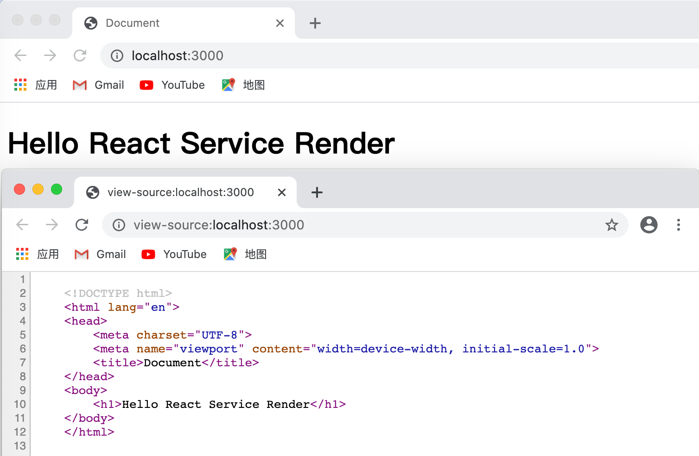
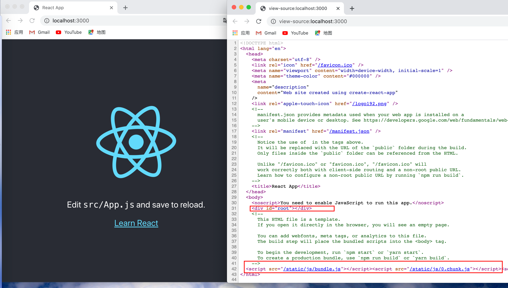
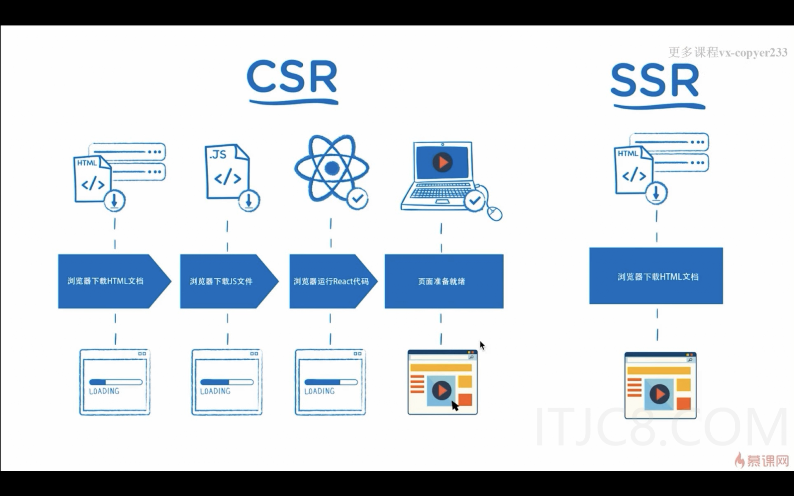

# React服务端渲染-SSR

## 一. 服务端渲染基础

### 1.1 什么是服务端渲染

> 简单来说，就是通过服务器端生成HTML，组装好页面数据，返回给浏览器。
>
> 浏览器拿到服务端返回的html文件，直接渲染出页面

我们来看如下一个服务端渲染案例

~~~js
//app.js
const express = require('express')

const app = express()

app.get('/',(req,res) => {
    res.send(`
    <!DOCTYPE html>
    <html lang="en">
    <head>
        <meta charset="UTF-8">
        <meta name="viewport" content="width=device-width, initial-scale=1.0">
        <title>Document</title>
    </head>
    <body>
        <h1>Hello React Service Render</h1>
    </body>
    </html>
    `)
})

app.listen(3000,function(){
    console.log('Server running...')
})
~~~

在命令行运行 `node app.js`,在浏览器通过 `localhost:3000` 访问。然后我们通过调试工具看一下源代码

可以看到，页面展示的内容在源代码中完全的呈现出来，这说明服务器返回给浏览器的就是完整的Html文件，浏览器只需要将其渲染出来即可

### 1.2 什么是客户端渲染

> 前面说到，服务端渲染是由服务端组装HTML，那么客户端渲染，也就是在客户端组装HTML内容

通过 `create-react-app` 创建的React项目就是客户端渲染，来看一下跟上面的服务端渲染有什么不一样

查看源代码的时候，可以发现，`body` 标签中只有一个id为root的div，然后通过 `bundle.js` 文件来组装DOM，然后插入到root中

像这种通过客户端加载j s文件，完成页面组装和加载的，就是客户端渲染

### 1.3 客户端渲染和服务端渲染优缺点

**客户端渲染优缺点**

- 前后端分离，开发效率比较高

- 首屏时间比服务端渲染慢，不利于SEO
- 大多数爬虫只能识别html中的文本内容，不能识别j s文本中的内容
- 客户端渲染是通过bundle.js文件来渲染页面内容
- 客户端渲染举例：通过 create-react-app 创建的项目就是客户端渲染

**服务端渲染**

- 更好的SEO，更快的首屏渲染
- 代码量比客户端渲染大，开发效率更低一点
- 增加了服务端的压力

### 1.4 客户端渲染和服务端渲染的本质区别

**本质区别：**本质区别是由谁来完成HTML完整拼接，服务端渲染是在服务器生成DOM树，客户端渲染是在客户端生成DOM树

**响应速度：**服务端渲染的速度快于客户端渲染

**SEO：**服务端渲染更利于SEO，大部分爬虫只能爬去HTMＬ文件中的内容，服务端渲染就是直接把完整的ＨＭＴＬ返回给浏览器进行渲染的，而客户端渲染是通过ｊｓ进行加载的，爬虫无法识别ｊｓ文件中的内容

**开发效率**：客户端渲染的开发效率要高于服务端渲染。客户端渲染开发是前后端分离，效率更高。服务端渲染增加了前后端的耦合性，开发难度提高，效率降低

**直观的区分客户端渲染和服务端渲染：**网页源码里面可以直接看到网页内容的是服务端渲染，否则，就是客户端渲染，通过bundle.js文件来进行页面渲染

## 二. 项目工程化

### 2.1 项目目录

**新建项目目录 `service-render-01`,项目结构如下**

> `webpack.server.js`: webpack 打包配置文件
>
> `.gitignore`: git操作提交的时候忽略上传的配置
>
> `package.json`: node项目配置
>
> `src>index.js`: 项目入口文件，用于写服务端代码
>
> `src/containers/Home/index.js`: 项目第一个组件，用于展示初始化页面

### 2.2 package.json文件

> 对于经验不够丰富的开发者而言，package.json文件的配置是很容易对项目运行产生报错的，因为存在很多node插件版本冲突问题
>
> 所以这里先给出一套具体版本的安装包，如果想自己配置相关插件版本，可能会存在一些版本兼容性问题，请自行到  [stackoverflow](https://stackoverflow.com/questions) 寻找解决方案

~~~js
{
  "name": "ServerRenderDemo",
  "version": "1.0.0",
  "description": "",
  "main": "index.js",
  "scripts": {
    "test": "echo \"Error: no test specified\" && exit 1",
    "dev": "npm-run-all --parallel dev:**",
    "dev:start": "nodemon --watch build --exec node './build/bundle.js'",
    "dev:build": "webpack --config webpack.server.js --watch"
  },
  "keywords": [],
  "author": "",
  "license": "ISC",
  "dependencies": {
    "babel-core": "6.26.3",
    "babel-loader": "7.1.5",
    "babel-preset-env": "1.7.0",
    "babel-preset-es2015": "^6.24.1",
    "babel-preset-react": "6.24.1",
    "babel-preset-stage-0": "6.24.1",
    "express": "4.16.3",
    "react": "16.4.1",
    "react-dom": "^16.13.1",
    "webpack": "4.16.0",
    "webpack-node-externals": "1.7.2"
  },
  "devDependencies": {
    "webpack-cli": "3.0.8"
  }
}

~~~

### 2.3 入口文件

**src/index.js**

~~~js
import express from 'express'
import React from 'react'
import { renderToString } from 'react-dom/server'
import Home from './containers/Home'

const app = express()
const content = renderToString(<Home />)

app.get('/',(req,res) => {
    res.send(`
    <!DOCTYPE html>
    <html lang="en">
    <head>
        <meta charset="UTF-8">
        <meta name="viewport" content="width=device-width, initial-scale=1.0">
        <title>SSR Demo</title>
    </head>
    <body>
        ${content}
    </body>
    </html>
    `)
})

app.listen(3000,function(){
    console.log('Server running on localhost:3000...')
})
~~~

### 2.4 webpack配置文件

**webpack.server.js**

~~~js
const path = require('path')
const nodeExternals = require('webpack-node-externals')

module.exports = {
    // 指定执行目标环境
    target: 'node',
    // 指定运行模式
    mode: 'development',
    // webpack打包入口文件
    entry: './src/index.js',
    // webpack打包生成文件名及目录
    output: {
        filename: 'bundle.js',
        path: path.resolve(__dirname,'./build')
    },
    externals : [nodeExternals()],

    // 配置js文件解析规则，ES6转化，react代码识别
    module: {
        rules: [
            {
                test: /\.js?$/,
                loader:'babel-loader',
                exclude: /node_modules/,
                options: {
                    presets: ['react','stage-0',['env',{
                        targets: {
                            browsers: ['last 2 versions']
                        }
                    }]]
                }
            }
        ]
    }
}
~~~

### 2.5 首个页面

~~~js
import React from 'react'

const Home = () =>{
    return (
Welcome to Home--可修改内容测试
)
}

export default Home
~~~

### 2.6 运行项目

> 以上代码准备就绪之后就可以安装依赖，打包，运行了

- **安装依赖**：进入项目根目录，`yarn add` 或者 `cnpm install`
- **执行打包命令**：`npm run dev:build`
- **开启服务器并监听文件修改和打包**：`npm run dev`

打开浏览器访问：`localhost:3000`，出现以下页面即运行成功，可以修改 `src/Home/index.js` 文件中的内容并保存，刷新浏览器检查文件修改是否被监听，刷新浏览器页面更新即证明监听成功

### 2.7 项目完整源码

